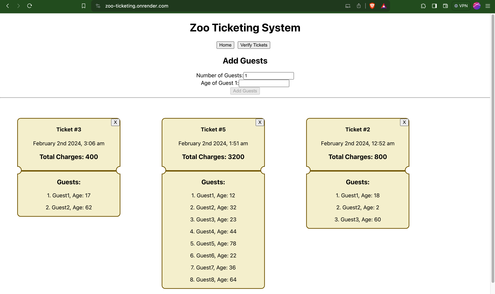
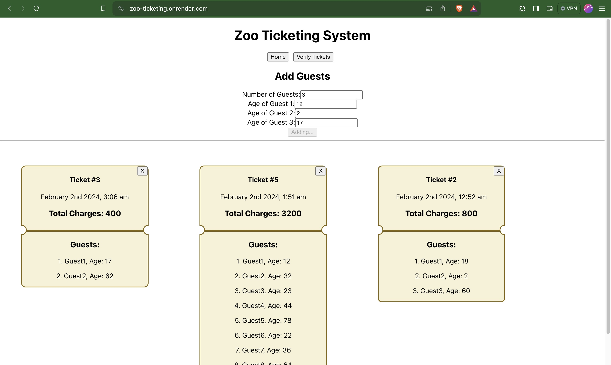
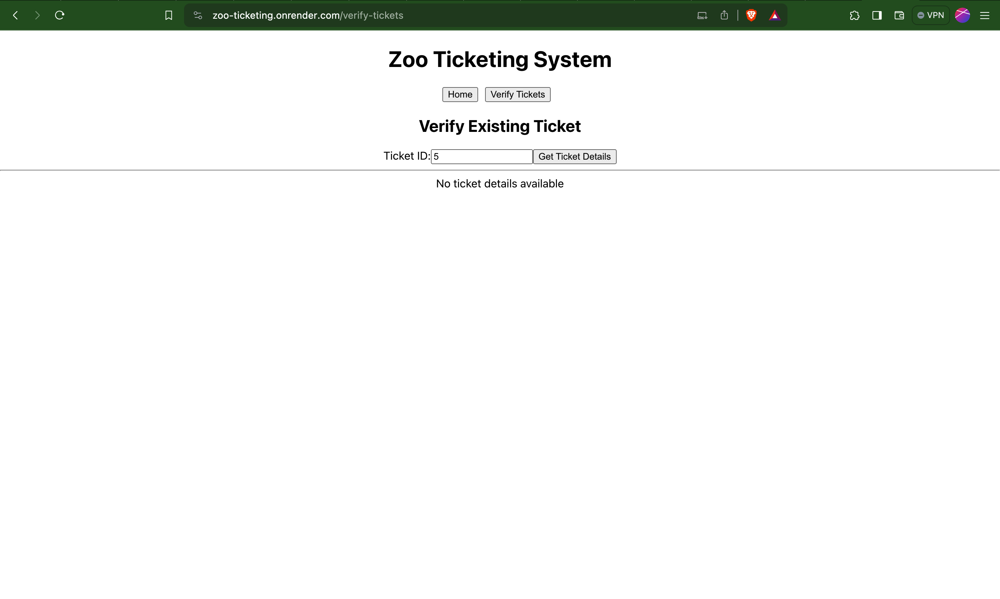
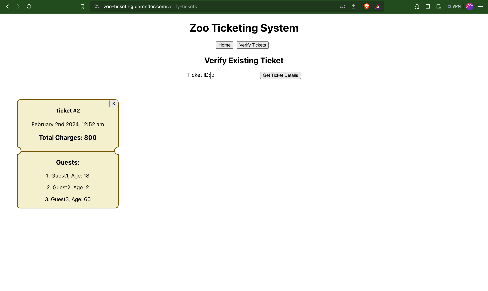

# Zoo Ticketing System - Jalan Technologies Assessment

This project is a part of the assessment for Jalan Technologies. It provides a simple and efficient solution for managing zoo tickets. The system is built using modern web technologies, with the frontend developed in ReactJS and the backend powered by Node.js and MongoDB.

## Project URLs

- **Backend**: [Zoo Ticketing Backend](https://jalan-zoo-ticketing.onrender.com/)
(Please allow backend service to be up in ~50 seconds [since I'm using free plan to host backend service] after ~50 seconds, it will keep working)
- **Frontend**: [Zoo Ticketing Frontend](https://zoo-ticketing.onrender.com/)

## Technologies Used

### Frontend
- **ReactJS**: A JavaScript library for building user interfaces.
- **Axios**: A promise-based HTTP client for making API requests.
- **React Router Dom**: A routing library for React applications.
- **Moment.js**: A library for parsing, validating, manipulating, and displaying dates and times.

### Backend
- **Node.js**: A JavaScript runtime for server-side development.
- **Express**: A web application framework for Node.js.
- **Mongoose**: An ODM (Object Data Modeling) library for MongoDB and Node.js.
- **Cors**: Middleware for handling Cross-Origin Resource Sharing in Express.
- **Dotenv**: A zero-dependency module for loading environment variables from a .env file.

## Project Structure

### Frontend (Client)
- **src**: Contains the source code for the React application.
  - **components**: Reusable React components.
  - **services**: API service functions using Axios.
  - **common**: Common utility components.
- **public**: Public assets and index.html.

### Backend (Server)
- **bin/www**: Entry point for the server.
- **routes**: Express route definitions.
- **controllers**: Logic to handle HTTP requests.
- **models**: Mongoose schema models.
- **utils**: Utility functions and configurations.

## How to Run

### Frontend
## Install dependencies
npm install

## Run the development server
npm start

### Backend
## Install dependencies
npm install

## Run the production server
npm start

## Run the development server
npm start-dev

## Screenshots

*Add Guests*

*Enter Guests Details*

*Verify InValid Ticket*

*Verify Valid Ticket*